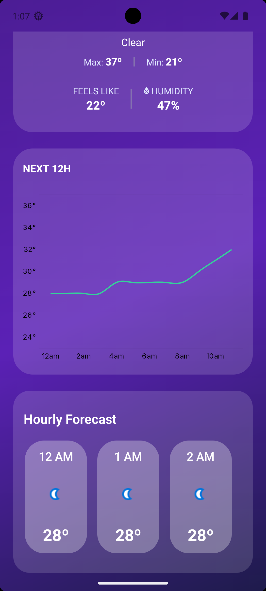
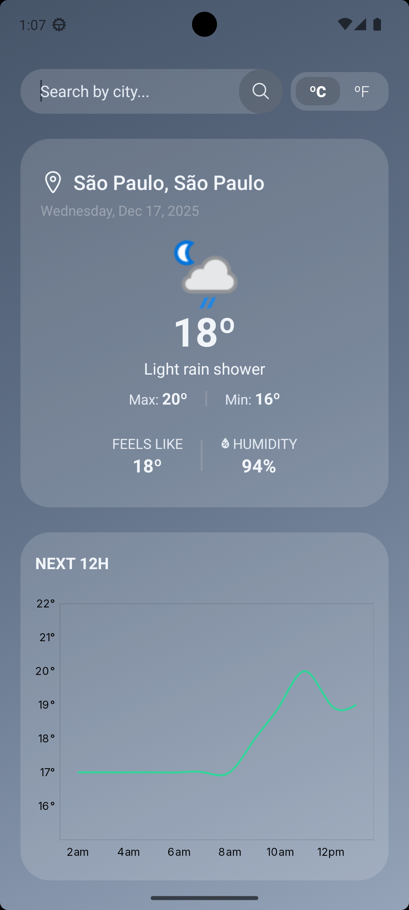
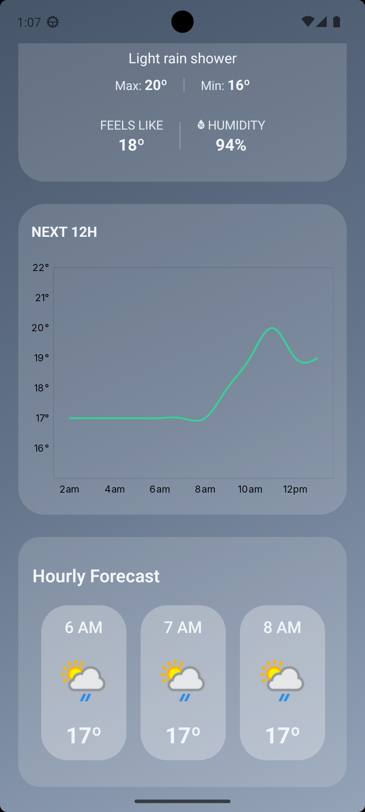

# Weather App

A modern mobile weather application built with React Native and Expo, featuring dynamic theming, real-time forecasts, and an intuitive user experience.

## Screenshots

<div>
  
  
  
  
</div>

## Features

- **Dynamic Theming:** The entire UI adapts its color scheme based on current weather conditions, creating an immersive experience that reflects the atmosphere outside.
- **Forecast Chart:** A visual chart that displays temperature fluctuations over the next 24 hours, helping you quickly identify trends.
- **Global City Search:** Access weather information for any location worldwide with intelligent search functionality.
- **12-Hour Visual Forecast:** An elegant, scrollable timeline displays hourly weather predictions, making it easy to plan your day at a glance.
- **Temperature Units:** Seamlessly toggle between Celsius and Fahrenheit to match your preference.
- **Location-Aware:** Automatically detects your current location on startup to deliver immediate, relevant weather data (with permission).
- **Localized Experience:** Dates are automatically formatted according to your device's language and regional settings for a native feel.
- **Real-Time Data:** Integrates with WeatherAPI to provide accurate, up-to-date weather information and forecasts.

## Tech Stack

- **React Native** - Cross-platform mobile development framework
- **Expo** - Development platform and toolchain
- **TypeScript** - Type-safe development for better code quality
- **React Context API** - Efficient state management for theming and app-wide data
- **Expo Location** - Geolocation services for automatic weather updates
- **Expo Localization** - Device language and region detection for proper date/time formatting
- **Victory Native** - Charting library for visualizing weather data
- **WeatherAPI** - Reliable weather data provider

## Project Structure

```
src/
├── app/              # App entry point and screens
├── components/       # Reusable UI components
├── contexts/         # React Context providers
├── hooks/            # Custom hooks
├── services/         # API integration
└── utils/            # Helper functions
```

## Setup

### Prerequisites

- Node.js
- Yarn or npm
- Expo CLI
- **Android Studio** (for Android development) or **Xcode** (for iOS development on macOS)

> **⚠️ Important:** This app uses Victory Native for charting, which requires native modules. It **cannot run on Expo Go**. You must use a development build or run on an emulator/physical device with a custom build.

### Installation Steps

1. **Clone the repository:**

```bash
git clone <your-repository-url>
cd weather-app
```

2. **Install dependencies:**

```bash
yarn install
```

3. **Configure environment variables:**
   Create a `.env` file in the root directory:

```
EXPO_PUBLIC_API_KEY=your_api_key_here
```

Get your free API key from [WeatherAPI.com](https://www.weatherapi.com/)

4. **Generate native project files:**

```bash
   npx expo prebuild
```

> This command generates the `android` and `ios` folders with all necessary native code and configurations.

5. **Run the app:**

   **For Android (using Android Studio emulator or physical device):**

```bash
   npx expo run:android
```

**For iOS (macOS only, using Xcode simulator or physical device):**

```bash
   npx expo run:ios
```

> The `run` commands will automatically build and launch the app with all native dependencies included.

### Why Not Expo Go?

This application uses **Victory Native** for rendering charts, which relies on native modules that are not included in the Expo Go runtime. To run this app, you need to:

1. Run `npx expo prebuild` to generate native project folders
2. Use `npx expo run:android` or `npx expo run:ios` to build and launch the app

## License

This project is licensed under the MIT License - see the [LICENSE](LICENSE) file for details.
